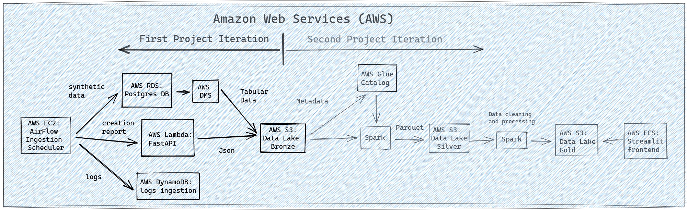

# **SITUATION**

As a data scientist, I realized that it is fundamental to understand not only the data scientist tools but also the data engineering ones to deliver more value and more robust solutions to my projects. 

So, my main idea with this project was to dive into data engineering fundamentals in both a theoretical and practical way.

To maximize my understanding of data engineering, I created synthetic data ingestion in the AWS environment. The first iteration of this project was mainly concerned with data ingestion and gave me a first immersive contact with data engineering tools; the second iteration will improve the solutions of the first cycle and will complete the architecture by delivering an analytical dashboard.

# **TASK**

The idea is to create synthetic data regarding customer behaviour for two groups of customers: control and treatment. We would generate this behaviour with statistical distributions (e.g. Poisson and Gamma distributions) and would ingest both the created customer behaviour and the statistical distribution params in the architecture. The data would flow throughout the architecture, e.g. data ingestion layer, a bronze layer, a silver layer, etc.

As the output, we would have the data regarding the customer behaviour and its statistical distribution blueprint. Then, we could use A/B testing tools to check if there is a statistically significant difference between the control and the treatment groups. However, once we know the original distribution of both groups, we know if they are different or not, so we will be able to check if the A/B tests would give us the correct result of not (especially regarding type I and type II errors).

# **ACTION**

1. *Create a local package with all the scripts necessary to simulate synthetic data for hypothetical customers.*
2. *Make use of the Continuous Integration concepts to test all scripts and make sure they are working as expected*
3. *Ingest the synthetic data on an AWS RDS database.*
4. *Ingest the params that generated the synthetic data (e.g. lambda of Poisson distribution, shape and scale of Gamma distribution) in an AWS S3 bucket via an API (FastAPI as a lambda function in AWS Lambda)*
5. *Save the logs of all intermediate steps regarding data creation and ingestion on a DynamoDB table*
6. *Schedule the data ingestion workflow to run weekly using Airflow in AWS EC2 server*
7. *Make sure the architecture is working in the cloud without any error/bug*

## **Folder structure**

- *.github*: code for GitHub actions integration (CI)
- *airflow*: code used to deploy the Airflow scheduler on AWS EC2
- *img*: project images
- *lambda_api*: code used to create a FastAPI on AWS Lambda
- *scripts*: scripts created for the project (none so far)
- *synthetic_data_ingestion*: local package with all the scripts that generate the synthetic data and ingest it on their respective AWS service
- *test*: code that tests the data ingestion through the local package.
- *Makefile*: directives to the make automation tool.
- *README.md*: project overview 
- *requirements.txt*: required dependencies for the project.
- *setup.py*: the code to set up the local package.

# **RESULTS**

The following image represents the original concept of this project:

Except for minor details, the first project iteration is over. In other words:

- **Airflow in AWS EC2 is working**;

- **Postgress database in AWS RDS is working**;

- **FastAPI in AWS Lambda is working**;

- **AWS DynamoDB is working**;

- **Data Lake Bronze in AWS S3 is working**;

*All of these previous tools are working smoothly in the AWS cloud.*

Besides, **97% of the python code used for this project passes the CI tests**. 

# **CONCLUSIONS**

Even if you are a data scientist, understanding the fundamentals of data engineering:

- *makes it possible for your projects to deliver more valuable and robust solutions;*

- *makes you a more independent data scientist (you can build your solutions if you don't have the support of data engineers);*

- *makes you understand the workflow before the data is available to you;*

- *makes it possible for you to contribute with better solutions for the data engineering team;*

- *forces you to adopt coding best practices.*

# **LESSONS LEARNED**

**How to decide the data architecture for a data engineering project.**

**How to create a local python package for the project.**

**How to use Continuous Integration tools to test the project code.**

**How to ingest the synthetic data on an AWS RDS database.**

**How to deploy an API with FastAPI and deploy it as a lambda function in AWS Lambda).**

**How to ingest data on AWS S3 bucket via an intermediate API.**

**How to ingest data on an AWS DynamoDB table.**

**How to schedule a workflow using Airflow in AWS EC2 server.**

**How to configure AWS to integrate services of the same project.** 

# **NEXT STEPS TO IMPROVE**

**CI**: expand tests to achieve 100% of coverage and check more edge cases.

**Local Package**: revise the local package to make scripts more efficient in terms of computational resource use.

**AWS DMS**: migrate the data from AWS RDS to the AWS S3 bucket with the AWS DMS.

**AWS configuration**: revise policies and roles to increase the security of the architecture.

**Second project iteration steps**: work on the steps after the Data Lake Bronze (from AWS Glue and Spark until Streamlit in AWS ECS)